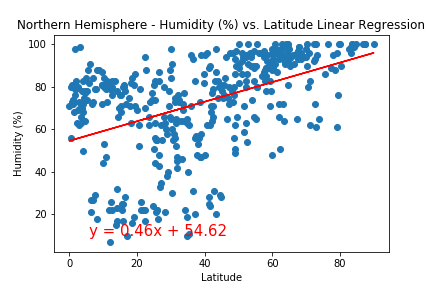
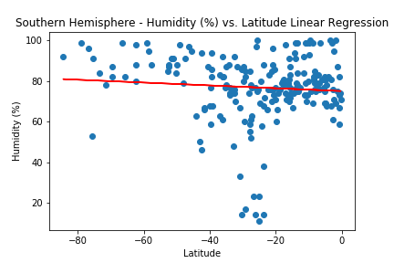

# Python API Challenge

## Background

Data's true power is its ability to definitively answer questions. So, let's take what you've learned about Python requests, APIs, and JSON traversals to answer a fundamental question: "What is the weather like as we approach the equator?"

Now, we know what you may be thinking: “That’s obvious. It gets hotter.” But, if pressed for more information, how would you prove that?

## Part 1: WeatherPy

In this deliverable, you'll create a Python script to visualize the weather of over 500 cities of varying distances from the equator. You'll use the citipy Python library Links to an external site., the OpenWeatherMap API Links to an external site., and your problem-solving skills to create a representative model of weather across cities.

To get started, the code required to generate random geographic coordinates and the nearest city to each latitude and longitude combination is provided.

### Requirement 1: Create Plots to Showcase the Relationship Between Weather Variables and Latitude

To fulfill the first requirement, you'll use the OpenWeatherMap API to retrieve weather data from the cities list generated in the starter code. Next, you'll create a series of scatter plots to showcase the following relationships:

* Latitude vs. Temperature

* Latitude vs. Humidity

* Latitude vs. Cloudiness

* Latitude vs. Wind Speed

### Requirement 2: Compute Linear Regression for Each Relationship

To fulfill the second requirement, compute the linear regression for each relationship. Separate the plots into Northern Hemisphere (greater than or equal to 0 degrees latitude) and Southern Hemisphere (less than 0 degrees latitude). You may find it helpful to define a function in order to create the linear regression plots.

Next, create a series of scatter plots. Be sure to include the linear regression line, the model's formula, and the r values as you can see in the following image

You should create the following plots:

* Northern Hemisphere: Temperature vs. Latitude

* Southern Hemisphere: Temperature vs. Latitude

* Northern Hemisphere: Humidity vs. Latitude

* Southern Hemisphere: Humidity vs. Latitude

* Northern Hemisphere: Cloudiness vs. Latitude

* Southern Hemisphere: Cloudiness vs. Latitude

* Northern Hemisphere: Wind Speed vs. Latitude

* Southern Hemisphere: Wind Speed vs. Latitude

# Part 2: VacationPy

In this deliverable, you'll use your weather data skills to plan future vacations. Also, you'll use Jupyter notebooks, the geoViews Python library, and the Geoapify API.

The code needed to import the required libraries and load the CSV file with the weather and coordinates data for each city created in Part 1 is provided to help you get started.

Your main tasks will be to use the Geoapify API and the geoViews Python library and employ your Python skills to create map visualizations.

To succeed on this deliverable of the assignment, open the VacationPy.ipynb starter code and complete the following steps:

1. Create a map that displays a point for every city in the city_data_df DataFrame as shown in the following image. The size of the point should be the humidity in each city.

2. Narrow down the city_data_df DataFrame to find your ideal weather condition. For example:

My weather conditions:

Wind Speed (mph)"] <= 10 
Max Temp (F)"] >= 70 & Max Temp (F)"] <= 80
Cloudiness (%)"] == 0)

3. Create a new DataFrame called hotel_df to store the city, country, coordinates, and humidity.

4. For each city, use the Geoapify API to find the first hotel located within 10,000 meters of your coordinates.

5. Add the hotel name and the country as additional information in the hover message for each city on the map (narrowed by my conditions) as in the following image:

